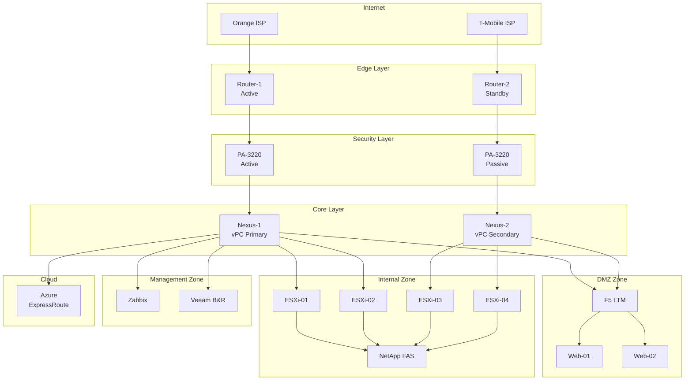

# Rozdział 6: AI w Dokumentacji Technicznej i Bazach Wiedzy

## Wprowadzenie

Dokumentacja techniczna to jeden z najbardziej zaniedbywanych aspektów pracy w IT. Każdy wie, że dobra dokumentacja jest niezbędna, ale w codziennym pędzie — między gaszeniem pożarów, wdrażaniem zmian i obsługą zgłoszeń — aktualizacja dokumentacji spada na koniec listy priorytetów. Efekt? Przestarzałe procedury, brakujące runbooki, wiedza zamknięta w głowach pojedynczych osób.

Sztuczna inteligencja zmienia tę sytuację fundamentalnie. AI może pomóc w:
- **Tworzeniu dokumentacji od zera** — na podstawie konfiguracji, kodu lub opisu słownego
- **Aktualizacji istniejącej dokumentacji** — wykrywanie nieaktualnych informacji
- **Generowaniu runbooków** — procedury krok po kroku dla typowych operacji
- **Tłumaczeniu poziomu technicznego** — ten sam temat dla inżyniera, managera i użytkownika końcowego
- **Utrzymywaniu baz wiedzy** — kategoryzacja, tagowanie, wyszukiwanie

W tym rozdziale pokażemy praktyczne zastosowania AI w dokumentacji, z gotowymi promptami i workflow, które możesz wdrożyć od zaraz.

## Dlaczego dokumentacja jest tak ważna (i tak zaniedbywana)

### Koszt braku dokumentacji

Brak aktualnej dokumentacji kosztuje organizację na wiele sposobów:

| Problem | Konsekwencja | Koszt |
|---------|-------------|-------|
| Brak runbooka dla awarii | Dłuższy czas naprawy (MTTR) | Przestój = utrata przychodów |
| Wiedza w głowie jednej osoby | „Bus factor" = 1 | Ryzyko operacyjne |
| Przestarzałe procedury | Błędy przy wykonywaniu | Incydenty, audyty |
| Brak onboardingu | Nowy pracownik uczy się miesiącami | Koszty HR, produktywność |
| Brak dokumentacji zmian | Nie wiadomo dlaczego coś jest skonfigurowane | Trudniejszy troubleshooting |

### Dlaczego AI zmienia grę

Tradycyjnie, napisanie dobrej dokumentacji wymagało:
1. Czasu (którego nigdy nie ma)
2. Umiejętności pisania (nie każdy inżynier jest dobrym pisarzem)
3. Dyscypliny (aktualizacja po każdej zmianie)
4. Znajomości odbiorcy (inny język dla L1, inny dla L3)

AI eliminuje lub redukuje każdą z tych barier:
1. **Czas** — AI generuje draft dokumentu w minuty, nie godziny
2. **Pisanie** — AI tworzy czytelny, ustrukturyzowany tekst
3. **Aktualizacja** — AI może porównać dokumentację z aktualną konfiguracją
4. **Adaptacja** — AI może przetłumaczyć ten sam dokument na różne poziomy techniczne

## Podstawowe pojęcia

- **Runbook** — dokument opisujący krok po kroku procedurę operacyjną (np. restart usługi, failover bazy danych, eskalacja incydentu)
- **Baza wiedzy (Knowledge Base, KB)** — zorganizowany zbiór artykułów, procedur i rozwiązań problemów, dostępny dla zespołu
- **SOP (Standard Operating Procedure)** — standardowa procedura operacyjna, formalna wersja runbooka
- **Postmortem** — dokument analizujący incydent po jego rozwiązaniu (co się stało, dlaczego, jak zapobiec)
- **Change Record** — dokumentacja zmiany w infrastrukturze (co zmieniono, kiedy, dlaczego, jak cofnąć)
- **Architecture Decision Record (ADR)** — dokument opisujący decyzję architektoniczną i jej uzasadnienie

## AI w tworzeniu runbooków

### Czym jest dobry runbook

Dobry runbook powinien być:
- **Wykonalny** — każdy krok to konkretna akcja (komenda, kliknięcie, decyzja)
- **Kompletny** — zawiera WSZYSTKIE kroki, łącznie z weryfikacją
- **Zrozumiały** — osoba z podstawową wiedzą może go wykonać o 3 w nocy
- **Aktualny** — odzwierciedla obecny stan środowiska
- **Testowany** — ktoś go wykonał i potwierdził że działa

### Praktyczny przykład 1: Generowanie runbooka z opisu procedury

**Scenariusz:** Wiesz jak wykonać failover bazy danych SQL Server Always On, ale nigdy tego nie udokumentowałeś. Chcesz stworzyć runbook, który pozwoli innemu członkowi zespołu wykonać tę procedurę.

**Prompt:**

```
Stwórz kompletny runbook dla procedury ręcznego failover 
SQL Server Always On Availability Group. 

ŚRODOWISKO:
- SQL Server 2022 Enterprise
- 2 węzły: SQL-PRIMARY (aktywny) i SQL-SECONDARY (pasywny)
- Windows Server 2022, Windows Failover Cluster
- Availability Group: AG-PRODUCTION
- Bazy w AG: ERP_DB, CRM_DB, Reporting_DB
- Listener: AG-LISTENER.firma.local (port 1433)
- Aplikacje łączą się przez listener

SCENARIUSZ: Planowany failover (np. przed patchowaniem SQL-PRIMARY)

WYMAGANIA RUNBOOKA:
1. Sekcja "Przed rozpoczęciem" (prerequisites, weryfikacja)
2. Kroki z dokładnymi komendami T-SQL i PowerShell
3. Punkty decyzyjne (co robić jeśli krok się nie powiedzie)
4. Weryfikacja po każdym kroku (jak sprawdzić że zadziałało)
5. Sekcja "Po zakończeniu" (testy, powiadomienia)
6. Sekcja "Rollback" (jak cofnąć jeśli coś pójdzie nie tak)
7. Szacowany czas dla każdego kroku
8. Poziom uprawnień wymagany dla każdego kroku

FORMAT:
- Markdown z numerowanymi krokami
- Komendy w blokach kodu
- Ostrzeżenia wyróżnione (⚠️)
- Checkboxy do odhaczania wykonanych kroków
- Język: polski
```

**Wygenerowany runbook (fragment):**

```markdown
# Runbook: Failover SQL Server Always On AG

## Informacje ogólne
| Parametr | Wartość |
|----------|---------|
| Procedura | Planowany failover AG-PRODUCTION |
| Czas trwania | ~15-20 minut |
| Okno serwisowe | Wymagane (krótka przerwa w dostępie do DB) |
| Wymagane uprawnienia | sysadmin na obu węzłach SQL |
| Ostatnia aktualizacja | [DATA] |
| Testowano | [DATA OSTATNIEGO TESTU] |

## Przed rozpoczęciem

### Prerequisites checklist
- [ ] Masz uprawnienia sysadmin na SQL-PRIMARY i SQL-SECONDARY
- [ ] Masz dostęp RDP do obu serwerów
- [ ] Okno serwisowe jest zatwierdzone i zakomunikowane
- [ ] Backup baz danych wykonany (nie starszy niż 1h)
- [ ] SQL-SECONDARY jest w stanie SYNCHRONIZED (nie SYNCHRONIZING)
- [ ] Brak aktywnych długich transakcji na PRIMARY

### Weryfikacja stanu przed failover

**Krok 0.1: Sprawdź stan synchronizacji** (czas: 1 min)

```sql
-- Uruchom na SQL-PRIMARY
SELECT 
    ag.name AS ag_name,
    ar.replica_server_name,
    ars.role_desc,
    ars.synchronization_health_desc,
    drs.database_name,
    drs.synchronization_state_desc
FROM sys.dm_hadr_availability_replica_states ars
JOIN sys.availability_replicas ar ON ars.replica_id = ar.replica_id
JOIN sys.availability_groups ag ON ar.group_id = ag.group_id
JOIN sys.dm_hadr_database_replica_states drs 
    ON ars.replica_id = drs.replica_id
ORDER BY ar.replica_server_name, drs.database_name;
```

✅ **Oczekiwany wynik:** Wszystkie bazy na SECONDARY mają 
   `synchronization_state_desc = 'SYNCHRONIZED'`

⚠️ **Jeśli stan to SYNCHRONIZING:** NIE kontynuuj. Poczekaj 
   na synchronizację lub sprawdź przyczynę opóźnienia.

**Krok 0.2: Sprawdź opóźnienie replikacji** (czas: 1 min)

```sql
-- Uruchom na SQL-SECONDARY
SELECT 
    database_name,
    last_commit_time,
    DATEDIFF(SECOND, last_commit_time, GETDATE()) as lag_seconds
FROM sys.dm_hadr_database_replica_states
WHERE is_local = 1;
```

✅ **Oczekiwany wynik:** lag_seconds < 5 dla wszystkich baz

## Procedura failover

**Krok 1: Powiadom zespół** (czas: 2 min)
- [ ] Wyślij wiadomość na kanał #it-operations:
  "Rozpoczynam planowany failover AG-PRODUCTION z SQL-PRIMARY 
   na SQL-SECONDARY. Przewidywana przerwa: 1-2 minuty."

**Krok 2: Przełącz AG na tryb synchronous commit** (czas: 1 min)

```sql
-- Uruchom na SQL-PRIMARY (jeśli nie jest już synchronous)
ALTER AVAILABILITY GROUP [AG-PRODUCTION]
MODIFY REPLICA ON N'SQL-SECONDARY'
WITH (AVAILABILITY_MODE = SYNCHRONOUS_COMMIT);
```

⚠️ Poczekaj 30 sekund i powtórz Krok 0.1 aby potwierdzić 
   synchronizację.

**Krok 3: Wykonaj failover** (czas: 1-2 min)

```sql
-- Uruchom na SQL-SECONDARY (nowy primary)
ALTER AVAILABILITY GROUP [AG-PRODUCTION] FAILOVER;
```

✅ **Oczekiwany wynik:** Komenda kończy się bez błędu.
   SQL-SECONDARY staje się nowym PRIMARY.

⚠️ **Jeśli błąd:** NIE ponawiaj. Sprawdź komunikat błędu.
   Najczęstsze przyczyny:
   - Baza nie jest SYNCHRONIZED → poczekaj i spróbuj ponownie
   - Brak kworum klastra → sprawdź Windows Failover Cluster

**Krok 4: Weryfikacja po failover** (czas: 2 min)

```sql
-- Uruchom na SQL-SECONDARY (teraz PRIMARY)
SELECT 
    replica_server_name,
    role_desc
FROM sys.dm_hadr_availability_replica_states ars
JOIN sys.availability_replicas ar 
    ON ars.replica_id = ar.replica_id;
```

✅ **Oczekiwany wynik:**
   - SQL-SECONDARY: role_desc = 'PRIMARY'
   - SQL-PRIMARY: role_desc = 'SECONDARY'

**Krok 5: Test połączenia przez listener** (czas: 1 min)

```powershell
# Z dowolnej stacji roboczej
sqlcmd -S AG-LISTENER.firma.local -Q "SELECT @@SERVERNAME, GETDATE()"
```

✅ **Oczekiwany wynik:** Zwraca nazwę SQL-SECONDARY (nowy primary)
```


**Co zyskujesz:**
- Kompletny, testowalny runbook w 5 minut zamiast 2 godzin
- Każdy krok ma weryfikację — wiesz czy zadziałał
- Punkty decyzyjne — wiesz co robić gdy coś pójdzie nie tak
- Checkboxy — łatwo śledzić postęp podczas wykonywania
- Szacowane czasy — możesz zaplanować okno serwisowe

**Jak utrzymywać runbook aktualny:**
Po każdym wykonaniu procedury, poproś AI o aktualizację:
```
Wykonałem failover AG według tego runbooka. Napotkałem 
następujące różnice:
1. W kroku 3 musiałem najpierw wyłączyć automatyczny failover
2. Krok 4 wymagał dodatkowego sprawdzenia listener DNS
3. Cały proces trwał 25 minut, nie 15

Zaktualizuj runbook uwzględniając te obserwacje.
```

## AI w tworzeniu dokumentacji technicznej

### Dokumentacja z konfiguracji

Jednym z najpotężniejszych zastosowań AI jest generowanie dokumentacji na podstawie istniejącej konfiguracji. Zamiast pisać dokumentację od zera, wklejasz konfigurację i prosisz AI o jej opisanie.

**Prompt:**

```
Na podstawie poniższej konfiguracji serwera Nginx wygeneruj 
dokumentację techniczną zawierającą:

1. Opis ogólny (co ten serwer robi, jakie usługi hostuje)
2. Diagram przepływu ruchu (w formacie Mermaid)
3. Lista hostowanych domen/aplikacji
4. Konfiguracja SSL/TLS (jakie certyfikaty, kiedy wygasają)
5. Reguły proxy (skąd dokąd kieruje ruch)
6. Limity i zabezpieczenia (rate limiting, WAF rules)
7. Zależności (od jakich usług backend zależy)
8. Procedura restartu (z uwzględnieniem graceful reload)
9. Znane problemy i workaroundy

Format: Markdown, język: polski
Odbiorcy: zespół IT (L2/L3)

KONFIGURACJA:
[wklej nginx.conf]
```

### Dokumentacja z kodu

```
Na podstawie poniższego skryptu PowerShell wygeneruj:

1. OPIS FUNKCJONALNY (co robi, po co, kiedy uruchamiać)
2. WYMAGANIA (moduły, uprawnienia, zależności)
3. PARAMETRY (opis każdego parametru, wartości domyślne, przykłady)
4. PRZYKŁADY UŻYCIA (3-5 typowych scenariuszy)
5. TROUBLESHOOTING (co może pójść nie tak i jak naprawić)
6. CHANGELOG (szablon do wypełniania)

Format: Markdown z sekcjami
Język: polski
Poziom: operator L1 powinien umieć uruchomić skrypt

[wklej skrypt]
```

### Praktyczny przykład 2: Tworzenie bazy wiedzy z notatek i ticketów

**Scenariusz:** Masz setki rozwiązanych ticketów w systemie ITSM i notatki w OneNote/Confluence. Chcesz przekształcić tę rozproszoną wiedzę w uporządkowaną bazę wiedzy.

**Prompt — krok 1: Kategoryzacja:**

```
Poniżej 10 rozwiązanych ticketów z naszego systemu helpdesk. 
Dla każdego ticketu:

1. Zaproponuj kategorię (np. "Sieć > VPN", "Windows > Drukowanie")
2. Wyodrębnij problem (1 zdanie)
3. Wyodrębnij rozwiązanie (kroki)
4. Określ czy to powtarzalny problem (tak/nie)
5. Zaproponuj tytuł artykułu KB

Format odpowiedzi: tabela Markdown

TICKETY:
---
Ticket #4521 (2024-01-10)
Zgłoszenie: "Nie mogę połączyć się z VPN z domu, pisze 
'connection timed out'"
Rozwiązanie: Klient miał stary profil VPN. Usunięto profil, 
zaimportowano nowy z portalu IT. Dodatkowo ISP klienta blokował 
port UDP 500 — przełączono na TCP 443.

Ticket #4523 (2024-01-10)
Zgłoszenie: "Outlook nie synchronizuje się, ostatni mail 
z wczoraj"
Rozwiązanie: Profil Outlook uszkodzony po aktualizacji Office. 
Utworzono nowy profil Outlook (Control Panel > Mail > Show Profiles > 
Add). Skrzynka zsynchronizowała się po 15 minutach.

Ticket #4530 (2024-01-11)
Zgłoszenie: "Drukarka w pokoju 305 drukuje puste strony"
Rozwiązanie: Wymieniono toner. Problem nie był w IT — 
przekierowano do facility management z notatką o zamawianiu 
tonerów.

[... kolejne tickety ...]
---
```

**Prompt — krok 2: Generowanie artykułu KB:**

```
Na podstawie poniższych 3 ticketów dotyczących tego samego problemu 
(VPN connection timeout), stwórz artykuł do bazy wiedzy.

WYMAGANIA ARTYKUŁU:
1. Tytuł (jasny, wyszukiwalny)
2. Symptomy (co użytkownik widzi/zgłasza)
3. Przyczyny (lista możliwych przyczyn)
4. Rozwiązanie krok po kroku (z screenshotami — opisz co powinno 
   być na screenshocie)
5. Sekcja "Jeśli to nie pomogło" (eskalacja)
6. Tagi/słowa kluczowe (do wyszukiwania)
7. Powiązane artykuły (sugestie)

ODBIORCY: 
- Wersja dla L1 helpdesk (prowadzi użytkownika przez telefon)
- Wersja dla użytkownika (self-service, portal IT)

TICKETY:
[wklej 3 tickety z tym samym problemem]
```

**Wygenerowany artykuł KB (fragment):**

```markdown
# KB-0045: VPN — Nie można nawiązać połączenia (Connection Timed Out)

## Symptomy
Użytkownik zgłasza jeden z poniższych objawów:
- Klient VPN wyświetla komunikat "Connection timed out"
- Połączenie VPN "wisi" na etapie "Connecting..." przez >30 sekund
- VPN łączy się, ale natychmiast rozłącza

## Dotyczy
- GlobalProtect VPN Client (Windows 10/11)
- Połączenia z sieci domowej lub hotspot mobilny

## Przyczyny (od najczęstszej)
1. **Przestarzały profil VPN** (60% przypadków) — po zmianie 
   konfiguracji serwera VPN stare profile nie działają
2. **ISP blokuje porty VPN** (25%) — niektórzy dostawcy blokują 
   UDP 500/4500 (IPsec)
3. **Firewall na komputerze** (10%) — Windows Defender lub 
   antywirus blokuje klienta VPN
4. **Problem po stronie serwera** (5%) — sprawdź status na 
   stronie statusowej IT

## Rozwiązanie

### Krok 1: Sprawdź status usługi VPN
Wejdź na https://status.firma.pl i sprawdź czy usługa VPN 
jest oznaczona jako "Operational".
- ✅ Jeśli operational → przejdź do Kroku 2
- ❌ Jeśli degraded/outage → poinformuj użytkownika o awarii, 
  podaj ETA naprawy

### Krok 2: Zaktualizuj profil VPN
1. Otwórz klienta GlobalProtect
2. Kliknij ikonę ⚙️ (Settings)
3. W polu "Portal" wpisz: vpn.firma.pl
4. Kliknij "Connect"
5. Zaloguj się danymi firmowymi (email + hasło AD)

[Screenshot: okno GlobalProtect z polem Portal]

### Krok 3: Jeśli nadal nie działa — zmień protokół
1. Otwórz GlobalProtect Settings
2. Przejdź do zakładki "Connection"
3. Zmień "Preferred Protocol" z "IPsec" na "SSL"
4. Kliknij "Apply" i spróbuj połączyć ponownie

[Screenshot: ustawienia protokołu w GlobalProtect]

### Krok 4: Sprawdź firewall lokalny
```powershell
# Uruchom w PowerShell jako Administrator
Get-NetFirewallRule | Where-Object {
    $_.DisplayName -like "*GlobalProtect*" -or 
    $_.DisplayName -like "*PanGP*"
} | Format-Table DisplayName, Enabled, Action
```
Wszystkie reguły powinny mieć Enabled=True, Action=Allow.

## Jeśli to nie pomogło
Eskaluj do L2 Network z informacjami:
- Wynik polecenia: `ping vpn.firma.pl`
- Wynik polecenia: `Test-NetConnection vpn.firma.pl -Port 443`
- Wersja klienta GlobalProtect (Help > About)
- Nazwa ISP użytkownika

## Tagi
vpn, globalprotect, timeout, connection, remote, praca-zdalna

## Powiązane artykuły
- KB-0012: VPN — Wolne połączenie (split tunnel)
- KB-0023: VPN — Błąd certyfikatu
- KB-0031: VPN — Dwuskładnikowe uwierzytelnianie (MFA)
```

## AI w tłumaczeniu dokumentacji na różne poziomy

### Problem: Jeden temat, wielu odbiorców

Ten sam incydent lub zmiana musi być opisana inaczej dla:
- **Zarządu** — wpływ biznesowy, koszty, decyzje
- **Managera IT** — przyczyna, czas naprawy, zapobieganie
- **Inżyniera L3** — szczegóły techniczne, root cause, konfiguracja
- **Helpdesku L1** — co mówić użytkownikom, FAQ
- **Użytkowników końcowych** — co się stało, kiedy wróci, co robić

### Prompt do tłumaczenia poziomu technicznego

```
Poniżej opis techniczny incydentu (awaria storage). 
Przetłumacz go na 3 wersje dla różnych odbiorców:

WERSJA 1 — Dla zarządu (max 5 zdań):
- Wpływ na biznes
- Czas niedostępności
- Czy dane zostały utracone
- Co robimy aby zapobiec powtórzeniu

WERSJA 2 — Dla helpdesku (komunikat dla użytkowników):
- Prosty język, bez żargonu
- Co nie działa
- Kiedy wróci
- Co użytkownik może zrobić w międzyczasie

WERSJA 3 — Dla zespołu IT (postmortem):
- Pełne szczegóły techniczne
- Timeline
- Root cause analysis
- Action items

OPIS TECHNICZNY:
---
O 14:32 kontroler A w macierzy NetApp FAS8200 (cluster: 
PROD-STORAGE-01) przeszedł w panic z powodu firmware bug 
(BURT 1423567). Kontroler B przejął obsługę (takeover), 
ale z powodu niezaktualizowanego firmware na kontrolerze B, 
takeover trwał 4 minuty zamiast standardowych 30 sekund. 
W tym czasie wszystkie LUNy prezentowane do klastra VMware 
(ESXi 8.0) były niedostępne, co spowodowało APD (All Paths Down) 
na 45 datastorach. 12 VM-ek z krytycznymi usługami (ERP, CRM, 
poczta) straciło dostęp do dysków. Po takeover, 8 VM-ek 
wróciło automatycznie, 4 wymagały ręcznego restartu. 
Brak utraty danych (NVRAM preserved). Całkowity czas 
niedostępności usług: 7 minut.
---
```

**Wygenerowane wersje:**

**WERSJA 1 — Dla zarządu:**
```
Dzisiaj o 14:32 wystąpiła 7-minutowa przerwa w działaniu 
systemów ERP, CRM i poczty e-mail spowodowana awarią jednego 
z komponentów systemu przechowywania danych. Żadne dane nie 
zostały utracone. Wszystkie systemy zostały przywrócone do 
pełnej sprawności o 14:39. Przyczyna to znany błąd w 
oprogramowaniu producenta — aktualizacja naprawcza zostanie 
wdrożona w najbliższy weekend serwisowy. Wdrażamy również 
dodatkowy monitoring, który pozwoli wykryć podobne problemy 
zanim wpłyną na użytkowników.
```

**WERSJA 2 — Dla użytkowników:**
```
Szanowni Państwo,

Dzisiaj między 14:32 a 14:39 wystąpiła krótka przerwa 
w działaniu systemów firmowych (ERP, CRM, poczta). 
Wszystkie systemy działają już normalnie.

Co się stało: Awaria jednego z elementów infrastruktury 
serwerowej. Żadne dane nie zostały utracone.

Co robić: Jeśli nadal doświadczacie problemów, prosimy 
o restart aplikacji. Jeśli problem nie ustąpi, zgłoście 
ticket na portalu IT.

Przepraszamy za utrudnienia.
Zespół IT
```

### Automatyzacja komunikacji incydentowej

Możesz stworzyć szablon, który AI wypełni automatycznie:

```
Na podstawie poniższych danych o incydencie, wygeneruj 
komunikaty zgodne z naszym szablonem:

DANE INCYDENTU:
- Czas rozpoczęcia: [timestamp]
- Czas zakończenia: [timestamp]
- Dotknięte usługi: [lista]
- Przyczyna: [opis techniczny]
- Utrata danych: [tak/nie]
- Liczba dotkniętych użytkowników: [liczba]

WYGENERUJ:
1. Komunikat na Slack #incidents (krótki, techniczny)
2. E-mail do użytkowników (prosty język)
3. Wpis na stronę statusową (format: investigating/identified/resolved)
4. Notatka dla zarządu (1 paragraf)
5. Ticket w JIRA (tytuł + opis + priority + labels)
```

## AI w utrzymywaniu baz wiedzy

### Problem: Baza wiedzy się starzeje

Typowe problemy z bazami wiedzy:
- Artykuły napisane 3 lata temu odnoszą się do starej wersji systemu
- Procedury zawierają komendy, które nie działają w nowej wersji
- Screenshoty pokazują stary interfejs
- Linki prowadzą do nieistniejących stron
- Nikt nie wie, które artykuły są aktualne

### Workflow utrzymania bazy wiedzy z AI

**Krok 1: Audyt istniejących artykułów**

```
Poniżej artykuł z naszej bazy wiedzy napisany w 2022 roku. 
Nasz obecny stack to:
- Windows Server 2022 (wcześniej 2019)
- Exchange Online (wcześniej Exchange 2016 on-prem)
- Microsoft 365 E3
- Azure AD (teraz Entra ID)
- Intune (wcześniej SCCM)

Przeanalizuj artykuł i wskaż:
1. Które informacje są prawdopodobnie nieaktualne
2. Które komendy/procedury mogły się zmienić
3. Które screenshoty wymagają aktualizacji
4. Jakie nowe informacje należy dodać
5. Czy artykuł jest nadal potrzebny (czy problem jeszcze istnieje)

ARTYKUŁ:
[wklej artykuł]
```

**Krok 2: Automatyczna aktualizacja**

```
Zaktualizuj poniższy artykuł KB do obecnego środowiska:
- Zamień odniesienia do Exchange 2016 na Exchange Online
- Zamień komendy PowerShell Exchange on-prem na Exchange Online cmdlety
- Zamień SCCM na Intune
- Zamień Azure AD na Microsoft Entra ID
- Zachowaj strukturę i format artykułu
- Oznacz sekcje, których nie jesteś pewien tagiem [DO WERYFIKACJI]

[wklej artykuł]
```

**Krok 3: Generowanie brakujących artykułów**

```
Na podstawie naszej listy najczęstszych ticketów (top 20), 
zidentyfikuj tematy, dla których powinniśmy mieć artykuł KB 
ale prawdopodobnie nie mamy. Zaproponuj:

1. Tytuł artykułu
2. Krótki opis zawartości
3. Priorytet (na podstawie częstotliwości ticketów)
4. Szacowany czas napisania

TOP 20 TICKETÓW (ostatni kwartał):
1. Reset hasła AD (450 ticketów)
2. VPN nie łączy (320)
3. Outlook nie synchronizuje (280)
4. Drukarka nie drukuje (250)
5. Brak dostępu do folderu sieciowego (220)
6. Teams nie działa kamera/mikrofon (200)
7. Laptop wolno działa (180)
8. Nie mogę zainstalować programu (170)
9. Excel/Word się zawiesza (150)
10. WiFi rozłącza się (140)
[...]
```

## AI w generowaniu procedur operacyjnych

### Standard Operating Procedures (SOP)

SOP to formalne procedury wymagane przez audyty (ISO 27001, SOC 2, PCI DSS). Muszą być precyzyjne, kompletne i regularnie przeglądane.

**Prompt do generowania SOP:**

```
Wygeneruj Standard Operating Procedure (SOP) dla procesu:
"Nadawanie i odbieranie uprawnień dostępu do systemów IT"

WYMAGANIA:
- Zgodność z ISO 27001 (A.9 Access Control)
- Zgodność z RODO (zasada minimalizacji danych)
- Proces musi obejmować: wnioskowanie, zatwierdzanie, 
  implementację, przegląd, odbieranie
- Uwzględnij: onboarding, zmiana stanowiska, offboarding
- Role: wnioskodawca, przełożony, właściciel systemu, 
  administrator IT, audytor

FORMAT SOP:
1. Cel i zakres
2. Definicje i skróty
3. Odpowiedzialności (macierz RACI)
4. Procedura (flowchart + opis kroków)
5. Wyjątki i eskalacja
6. Metryki i KPI
7. Dokumenty powiązane
8. Historia zmian

Język: polski
Poziom formalności: wysoki (dokument audytowalny)
```

### Generowanie dokumentacji zmian (Change Records)

```
Na podstawie poniższego opisu zmiany, wygeneruj kompletny 
Change Record zgodny z ITIL v4:

OPIS ZMIANY:
Upgrade firmware na 24 przełącznikach Cisco Catalyst 9200 
z wersji 17.6.4 na 17.9.4. Zmiana wymagana ze względu na 
CVE-2024-XXXX (krytyczna podatność w SSH). Przełączniki 
obsługują sieć LAN w 3 budynkach biurowych (800 użytkowników).

WYGENERUJ:
1. Tytuł zmiany (krótki, opisowy)
2. Klasyfikacja (normal/standard/emergency)
3. Uzasadnienie biznesowe
4. Analiza ryzyka (prawdopodobieństwo x wpływ)
5. Plan implementacji (krok po kroku z czasami)
6. Plan testowania
7. Plan rollback
8. Plan komunikacji
9. Kryteria sukcesu
10. Wymagane zatwierdzenia
```

## AI w tworzeniu diagramów i wizualizacji

### Generowanie diagramów z opisu

AI może generować diagramy w formatach tekstowych (Mermaid, PlantUML, draw.io XML), które następnie renderujesz w narzędziach.

**Prompt:**

```
Na podstawie poniższego opisu infrastruktury, wygeneruj 
diagram sieci w formacie Mermaid:

INFRASTRUKTURA:
- 2 routery brzegowe (ISP1: Orange, ISP2: T-Mobile) w konfiguracji 
  active/standby (HSRP)
- 2 firewalle Palo Alto w HA (active/passive)
- 2 core switche (Cisco Nexus) w vPC
- 3 warstwy: DMZ, Internal, Management
- W DMZ: 2 web serwery za load balancerem F5
- W Internal: klaster VMware (4 hosty ESXi), storage NetApp
- W Management: serwery monitoringu (Zabbix), backup (Veeam)
- Połączenie do chmury Azure przez ExpressRoute

Diagram powinien pokazywać:
- Fizyczną topologię (urządzenia i połączenia)
- Segmentację sieci (VLAN/strefy)
- Redundancję (podwójne linie dla HA)
- Kierunek przepływu ruchu
```

**Wygenerowany diagram Mermaid:**



## Workflow: Od zera do kompletnej dokumentacji

### Plan 30-dniowy

Oto realistyczny plan wdrożenia dokumentacji z pomocą AI:

**Tydzień 1: Inwentaryzacja i priorytetyzacja**
- Dzień 1-2: Lista wszystkich systemów/usług bez dokumentacji
- Dzień 3: Priorytetyzacja (co jest krytyczne, co może poczekać)
- Dzień 4-5: Wybór narzędzia KB (Confluence, BookStack, GitBook, Wiki.js)

**Tydzień 2: Dokumentacja krytyczna**
- Dzień 6-7: Runbooki dla top 5 awarii (z AI)
- Dzień 8-9: Procedury DR dla krytycznych systemów (z AI)
- Dzień 10: Diagram sieci i lista kontaktów eskalacyjnych

**Tydzień 3: Baza wiedzy helpdesk**
- Dzień 11-12: Artykuły KB dla top 10 ticketów (z AI)
- Dzień 13-14: Procedury onboarding/offboarding (z AI)
- Dzień 15: Szablony komunikacji incydentowej

**Tydzień 4: Procesy i utrzymanie**
- Dzień 16-17: SOP dla kluczowych procesów (z AI)
- Dzień 18-19: Konfiguracja procesu review (kto, kiedy, jak)
- Dzień 20: Szkolenie zespołu z korzystania z KB i AI

### Utrzymanie dokumentacji — nawyki

1. **Po każdej zmianie** — poproś AI o wygenerowanie change record
2. **Po każdym incydencie** — poproś AI o postmortem na podstawie notatek
3. **Co tydzień** — przejrzyj 2-3 artykuły KB pod kątem aktualności
4. **Co miesiąc** — sprawdź czy nowe tickety wskazują na brakujące artykuły
5. **Co kwartał** — pełny przegląd runbooków (czy procedury nadal działają)

## Narzędzia wspierające dokumentację z AI

### Porównanie narzędzi

| Narzędzie | AI wbudowane | Format | Koszt | Najlepsze dla |
|-----------|-------------|--------|-------|---------------|
| Confluence + Atlassian Intelligence | Tak | Wiki | $$$ | Duże zespoły, ITSM |
| Notion AI | Tak | Docs/Wiki | $$ | Małe/średnie zespoły |
| GitBook | Nie (integracja) | Markdown/Git | $$ | Dokumentacja techniczna |
| BookStack | Nie | Wiki | Free (self-hosted) | Self-hosted, FOSS |
| Wiki.js | Nie | Markdown/Wiki | Free (self-hosted) | Self-hosted, Git sync |
| Obsidian + AI plugin | Plugin | Markdown | $ | Osobista baza wiedzy |

### Integracja AI z procesem dokumentacji

**Workflow z Git:**
1. Dokumentacja w Markdown w repozytorium Git
2. AI generuje/aktualizuje pliki .md
3. Pull Request z review przez zespół
4. Merge = publikacja
5. CI/CD buduje stronę (MkDocs, Docusaurus, Hugo)

**Workflow z Confluence:**
1. AI generuje treść w formacie Markdown
2. Kopiujesz do Confluence (lub używasz Atlassian Intelligence)
3. Dodajesz labels, space, permissions
4. Ustawiasz reminder o przeglądzie (co 3 miesiące)

## Podsumowanie rozdziału

Dokumentacja techniczna z AI to nie science fiction — to praktyczne narzędzie dostępne już dziś. Kluczowe wnioski:

1. **AI nie zastępuje wiedzy** — ale zamienia ją w dokumentację 10x szybciej niż ręczne pisanie
2. **Runbooki z AI** są kompletne, testowalne i łatwe do utrzymania
3. **Baza wiedzy** może być zbudowana w 30 dni zamiast 6 miesięcy
4. **Tłumaczenie poziomów** — ten sam incydent opisany dla zarządu, helpdesku i użytkowników w minuty
5. **Utrzymanie** jest kluczowe — dokumentacja bez aktualizacji szybko staje się bezwartościowa
6. **Proces > narzędzie** — nawet najlepsze AI nie pomoże bez nawyku dokumentowania

**Złota zasada dokumentacji z AI:** Generuj draft z AI, weryfikuj z ekspertem, publikuj po review, aktualizuj regularnie.

W następnym rozdziale przejdziemy do zastosowań AI w bezpieczeństwie IT — analizie logów, wykrywaniu zagrożeń i reagowaniu na incydenty.
